# Entity-Relationship Diagram

Generated from the actual schema in `backend/src/database/migrations/` — every table, column, and FK below traces to a specific migration, not hand-guessed.

```mermaid
erDiagram
    USERS ||--o{ REFRESH_TOKENS : "has"
    USERS ||--o{ USER_ROLES : "has"
    ROLES ||--o{ USER_ROLES : "has"
    USERS |o--o{ AUDIT_LOGS : "performed (nullable = system)"
    USERS |o--o{ WORK_ORDERS : "assigned to"
    USERS |o--o{ ASSET_STATE_HISTORY : "changed by"
    USERS |o--o{ INVENTORY_TRANSACTIONS : "recorded by"
    USERS |o--o{ NOTIFICATIONS : "resolved by"

    PLANTS ||--o{ LOCATIONS : "has"
    LOCATIONS ||--o{ LOCATIONS : "nests under (parent)"
    LOCATIONS ||--o{ ASSETS : "has"
    ASSET_TYPES ||--o{ ASSETS : "classifies"

    ASSETS ||--o{ MAINTENANCE_PLANS : "scheduled for"
    MAINTENANCE_PLANS ||--o{ MAINTENANCE_TASKS : "has"
    ASSETS ||--o{ WORK_ORDERS : "has"
    MAINTENANCE_PLANS |o--o{ WORK_ORDERS : "generates (nullable)"
    WORK_ORDERS ||--o{ WORK_ORDER_PARTS : "consumes"
    SPARE_PARTS ||--o{ WORK_ORDER_PARTS : "used in"

    SPARE_PARTS ||--o{ INVENTORY_TRANSACTIONS : "moves"
    WORK_ORDERS |o--o{ INVENTORY_TRANSACTIONS : "triggers (nullable)"

    ASSETS ||--o{ ASSET_STATE_HISTORY : "has"
    ASSETS ||--o{ TELEMETRY_READINGS : "reports"

    USERS {
        uuid id PK
        string email UK
        string password_hash
        boolean is_active
        timestamp created_at
    }

    ROLES {
        uuid id PK
        enum name UK "ADMIN, SUPERVISOR, TECHNICIAN, VIEWER"
    }

    USER_ROLES {
        uuid user_id PK_FK
        uuid role_id PK_FK
    }

    REFRESH_TOKENS {
        uuid id PK
        uuid user_id FK
        string token_hash
        timestamptz expires_at
        timestamptz revoked_at "nullable"
        uuid replaced_by_id "rotation chain"
        timestamp created_at
    }

    AUDIT_LOGS {
        uuid id PK
        uuid actor_user_id FK "nullable = system/auto"
        string entity_type "polymorphic, no formal FK"
        uuid entity_id "polymorphic, no formal FK"
        string action
        jsonb before
        jsonb after
        string source "manual / auto:condition-monitoring"
        timestamp created_at
    }

    PLANTS {
        uuid id PK
        string name
        string address
    }

    LOCATIONS {
        uuid id PK
        uuid plant_id FK
        string name
        uuid parent_location_id FK "self-referencing, nullable"
    }

    ASSET_TYPES {
        uuid id PK
        string name
        string category
    }

    ASSETS {
        uuid id PK
        uuid asset_type_id FK
        uuid location_id FK
        string tag UK
        string manufacturer
        string model
        enum criticality "LOW/MEDIUM/HIGH/CRITICAL"
        enum status "OPERATIONAL/UNDER_MAINTENANCE/CRITICAL/DECOMMISSIONED"
        timestamp installed_at
    }

    MAINTENANCE_PLANS {
        uuid id PK
        uuid asset_id FK
        string name
        int interval_days
        timestamp last_completed_at
        timestamp next_due_at
        boolean active
    }

    MAINTENANCE_TASKS {
        uuid id PK
        uuid plan_id FK
        string description
        int order_index
    }

    WORK_ORDERS {
        uuid id PK
        uuid asset_id FK
        uuid maintenance_plan_id FK "nullable: null when AUTO"
        enum status "OPEN/ASSIGNED/IN_PROGRESS/BLOCKED/COMPLETED/CANCELLED"
        enum source "MANUAL/PLANNED/AUTO"
        enum priority "LOW/MEDIUM/HIGH/CRITICAL"
        uuid assigned_to_user_id FK "nullable"
        text description
        timestamp opened_at
        timestamp assigned_at
        timestamp started_at
        timestamp completed_at
        timestamp cancelled_at
        numeric total_cost
        text ai_note "nullable, set by the AI diagnostic-notes feature"
    }

    WORK_ORDER_PARTS {
        uuid id PK
        uuid work_order_id FK
        uuid spare_part_id FK
        int quantity_used
        numeric unit_cost_at_completion
    }

    SPARE_PARTS {
        uuid id PK
        string sku UK
        string name
        int quantity_on_hand "CHECK >= 0"
        int reorder_threshold "CHECK >= 0"
        numeric unit_cost "CHECK >= 0"
    }

    INVENTORY_TRANSACTIONS {
        uuid id PK
        uuid spare_part_id FK
        int delta_quantity "CHECK <> 0"
        enum reason "CONSUMED/RESTOCK/ADJUSTMENT"
        uuid work_order_id FK "nullable"
        uuid created_by_user_id FK "nullable"
        int resulting_quantity "CHECK >= 0, snapshot"
        timestamp created_at
    }

    ASSET_STATE_HISTORY {
        uuid id PK
        uuid asset_id FK
        enum previous_status
        enum new_status
        timestamp changed_at
        uuid changed_by_user_id FK "nullable"
        string source "manual/work-order-completion/condition-monitoring"
    }

    TELEMETRY_READINGS {
        uuid id PK
        uuid asset_id FK
        numeric temperature
        numeric vibration
        numeric pressure
        timestamptz recorded_at
        timestamptz ingested_at
    }

    NOTIFICATIONS {
        uuid id PK
        enum type "CRITICAL_ASSET/OVERDUE_MAINTENANCE/LOW_STOCK"
        string related_entity_type
        uuid related_entity_id
        text message
        enum status "UNREAD/ACKNOWLEDGED/RESOLVED"
        timestamp created_at
        timestamp resolved_at
        uuid resolved_by_user_id FK "nullable"
        text ai_note "nullable, set by the AI diagnostic-notes feature"
    }
```

**Notable deliberate omissions from this diagram, not oversights:**

- **`maintenance_history` isn't a table.** It's a derived read — `GET /work-orders?assetId=&status=COMPLETED`. A completed work order already _is_ a maintenance history record; a separate table would duplicate the same facts. See `docs/design-decisions.md`.
- **`audit_logs`** is intentionally polymorphic (`entity_type` + `entity_id` as plain columns, no formal FK) so any entity in the system can be audited without a schema change. It's protected from mutation at the database level by both a `REVOKE` and a `BEFORE UPDATE OR DELETE` trigger.
