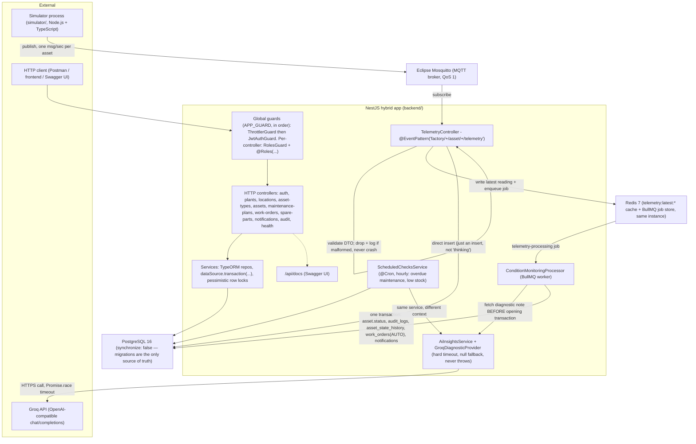

# Architecture

Redrawn from the brief's original pipeline sketch to match the **actual** implementation — real module names, real transport, real guard order.

## Request paths through this diagram

**HTTP path (most endpoints):** `CLIENT → GUARDS → CTRL → SERVICES → PG`. Every mutating write inside `SERVICES` happens inside a `dataSource.transaction(...)` and calls `AuditService.record(...)` with the _same_ transaction manager, so a business write and its audit entry commit or roll back together — never one without the other.

**Telemetry path:** the simulator is a separate OS process; it never talks to Postgres or the backend directly — only to Mosquitto. `TelemetryController` does the minimum to accept a reading quickly: validate, cache, enqueue, and a direct insert. No analysis happens on this hot path.

**Background worker / condition-monitoring path:** `ConditionMonitoringProcessor` consumes the queued job off the hot path, evaluates the deterministic rule, and — only if it trips — calls Groq _before_ opening the database transaction. If Groq times out, errors, or is disabled, `AI` returns `null` and the transaction proceeds exactly as it would have without it. The duplicate-prevention check inside this path is backed by the partial unique index on `work_orders`, so even a worker race can't create two open AUTO work orders for the same asset.

**Scheduled path:** `ScheduledChecksService` runs on `@nestjs/schedule`'s cron, independent of the MQTT/queue path, reusing the same `AI` service for its own notifications.
